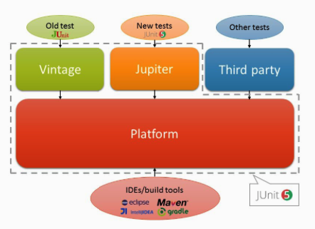

## JUnit versions
- JUnit 3
    
    JUnit 3 can work with Java 2 and higher

- JUnit 4.0 (Released on 2006.2.18)
   
   In JUnit 4, Java annotations are used to mark methods as tests. For this reason, JUnit 4 can only be used for Java 5 or later

- JUnit 5.0 (Released on 2017.9.10)
    

## Run test case in command line
JUnit 3, -cp means class path
```
    java -cp .:/usr/share/java/junit.jar junit.textui.TestRunner [test class name]
```
JUnit 4
```
    java -cp .:/usr/share/java/junit.jar org.junit.runner.JUnitCore [test class name]
```
JUnit 5
``` java -jar junit-platform-console-standalone-<version>.jar <Options>
```
# JUnit 5
## Junit 4 vs JUnit 5
- JUnit 4 is not modular, a single junit.jar dependency for everything
- Test discovery and execution are tightly coupled in JUnit 4
- JUnit 5 is created from scratch using Java 8 (Lambda expression and so on)
- JUnit 4 runners are not composable, that is, we can only use a single runner at a time.
  
  
## JUnit 5 architecture


- Platform, Jupiter(for new tests), Vintage (for old test)

